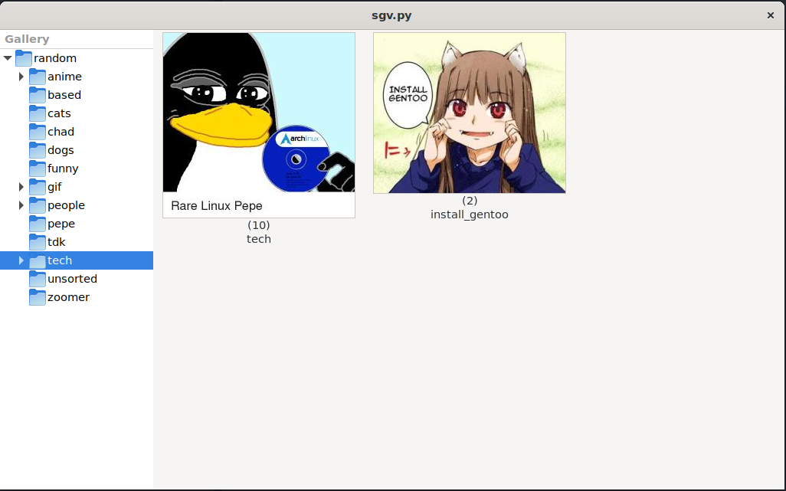

# *SimpleGalleryViewer*

## Install
#### Debian
```
sudo apt install pkg-config libcairo2-dev gcc python3-dev python3-pip libgirepository1.0-dev -y
python3 -m pip install --user -U PyGobject
```
#### ArchLinux
```
sudo pacman -Syu python-pip gtk3 gobject-introspection
python3 -m pip install --user -U PyGobject
```

## Settings
Default image viewer: [nsxiv](https://codeberg.org/nsxiv/nsxiv)

```json
// config.json
{
  "image_viewer": "nsxiv -bqr -z 90",
  "dir": ""
}
```



## TODO
- [ ] Settings menu
- [ ] GIF support
- [ ] Use GTK as image viwer?
